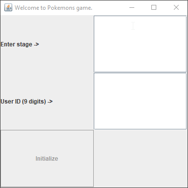
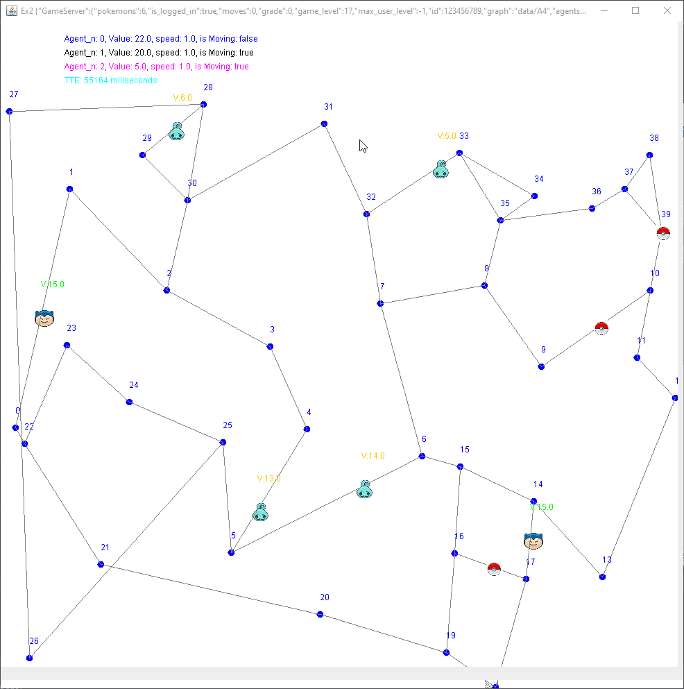
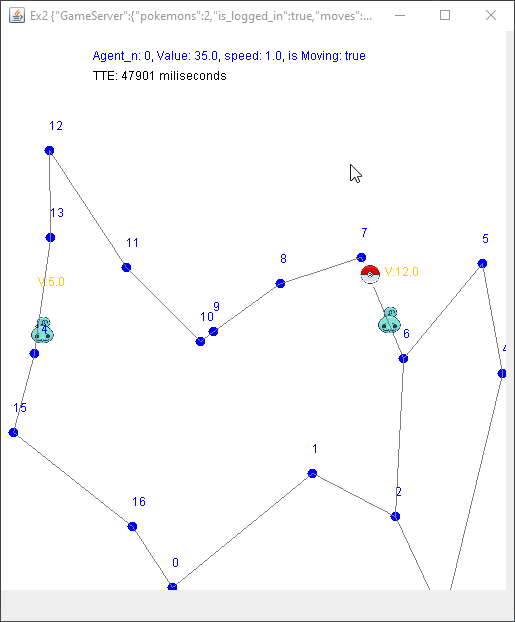

# About the project

This project represent a directional weighted
graph.

Graph is basicaly an HashMap of nodes.

Graph have basic operations such as: add node, remove node, connect two nodes, remove edge between nodes, get list of nodes in the graph, get list of edges in the graph, amount of nodes and number of edges.

Algo gives you the option to check if your graph is connected,
find shortes path, and shortest distance between two nodes.

•	classes are implementing Interfaces written by Boaz.


## Prerequisites

-	file games A0 -> a05. Can be found in "data" folder.
-	Images for pokemons. Can be found in "data" folder.
-	External jars can be found in "libs" folder.


- Ex2.jar can be used to run the program by:
```bash
java -jar Ex2.jar <id> <level_num>
```
..or simply double click the jar :)

## Getting Started

- build a Graph object using WGraph_DS class.
- add nodes to graph using Graph.addnode(<key>)
- connect between nodes using Graph.connect(<key1>, <key2>, weight)
- build a Algo object using WGraph_Algo class.
- check if your graph is connected via Algo.isConnected()
- find shortest path via Algo.shortestPath(<src_key>, <dest_key>)
- find shortest distance via Algo.shortestPathDist(<src_key>, <dest_key>)

### Pokemon game
This assignment, has the option to let you play a pokemon eating game 
On a directional weighted graph.

Goal of the game: Eat as many pokemons as possible under the time constraints.



note: ID is allowed to be a number only, 9 digits long.

#### some examples





## Contact info

name: Hadas Levy
Github: https://github.com/Hadas-l/Ex2_OOP

## Acknowledgements
- search, insert, delete in o(1) --> https://www.geeksforgeeks.org/design-a-data-structure-that-supports-insert-delete-search-and-getrandom-in-constant-time/

- djikstra algorithm --> https://en.wikipedia.org/wiki/Dijkstra%27s_algorithm

- priority queue decrease priority --> https://stackoverflow.com/questions/1871253/updating-java-priorityqueue-when-its-elements-change-priority
